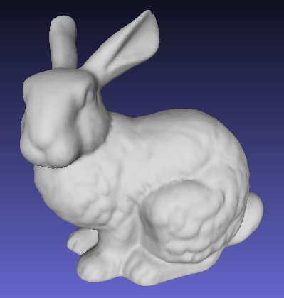

# Mesh2CadSurface

##### input Mesh (*.OBJ)
 

##### STEP1 Mesh Segmentation
 

##### STEP2 Mesh Parameterization
 

##### STEP3 Surface Fitting -> CAD data (IGES format)
 

## Requirements
[CGAL The Computational Geometry Algorithms Library](https://www.cgal.org/)  CGAL-4.13  
[Boost C++ libraries.](https://www.boost.org/)    boost_1_69_0  

Source code is the following project.
Add the executable file created by build to bin.  
[IGES-STEP-to-OBJ](https://github.com/Sanaxen/IGES-STEP-to-OBJ)  
[OBJ-to-IGES](https://github.com/Sanaxen/OBJ-to-IGES)  
[segmentation](https://github.com/Sanaxen/segmentation)  

## External Libraries 
OpenCASCADE7.1.0-vc10-64
